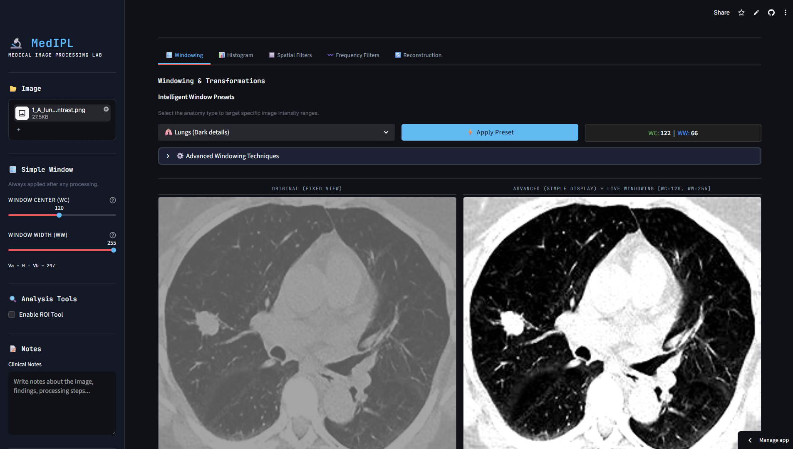

# 🔬 MedIPL — Medical Image Processing Laboratory

> A free, browser-based platform for professional-grade medical image processing — built for students, researchers, and clinicians who need powerful imaging tools without the cost or complexity of specialized software.

[](https://mediplapp-zvgbbgvhwrdivtgxmdqczg.streamlit.app/)


**🌐 [Try the live app — no installation required](https://mediplapp-zvgbbgvhwrdivtgxmdqczg.streamlit.app/)**

---



---

## What is MedIPL?

MedIPL is an online medical image processing laboratory developed as part of an undergraduate project at the **Department of Biomedical Engineering, University of West Attica**, in collaboration with the **MeDISP Lab**.

The goal: give anyone — a student, a researcher, a clinician — access to a full suite of imaging tools directly in the browser. No installation, no license fees, no IT dependencies.

---

## Features

### 🖼️ Image Processing Tools

| Tool | Description |
|------|-------------|
| **Windowing** | Standard & live windowing for contrast control |
| **Histogram** | Full range of histogram modification techniques |
| **Spatial Filters** | Comprehensive suite of spatial domain filters |
| **Frequency Filters** | Frequency domain filtering (FFT-based) |
| **Reconstruction** | Educational image reconstruction tool |

### 🛠️ Utilities

- 📝 **Notes** — in-app annotation
- 🎯 **ROI Selection** — Region of Interest analysis
- 💾 **Export** — save processed images locally

---

## Tech Stack

| | |
|---|---|
| **Language** | Python 3.8+ |
| **Framework** | Streamlit |
| **Key Libraries** | NumPy, Pillow, OpenCV, Matplotlib |

---

## Run Locally

```bash
# 1. Clone the repository
git clone https://github.com/G-Dimitrakakis/MedIPL_App.git
cd MedIPL

# 2. Install dependencies
pip install -r requirements.txt

# 3. Launch the app
streamlit run app.py
# Opens automatically at http://localhost:8501
```

---

## Acknowledgements

- **Professor Dionysios Cavouras** — for guidance and knowledge sharing throughout the project
- **MeDISP Lab, University of West Attica** — for the opportunity to work on this meaningful project

---

## License

Open for educational and research use. For other use cases, please [get in touch](https://www.linkedin.com/in/YOUR-LINKEDIN-USERNAME/).
